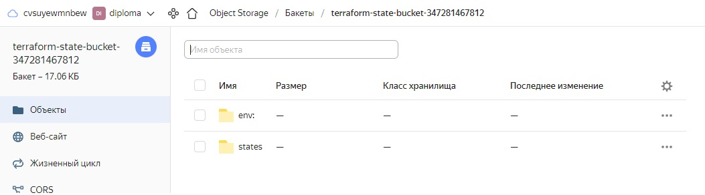
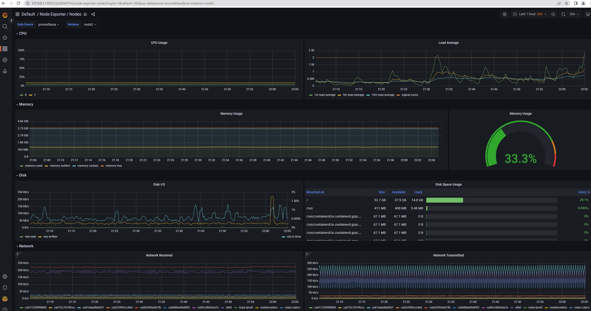
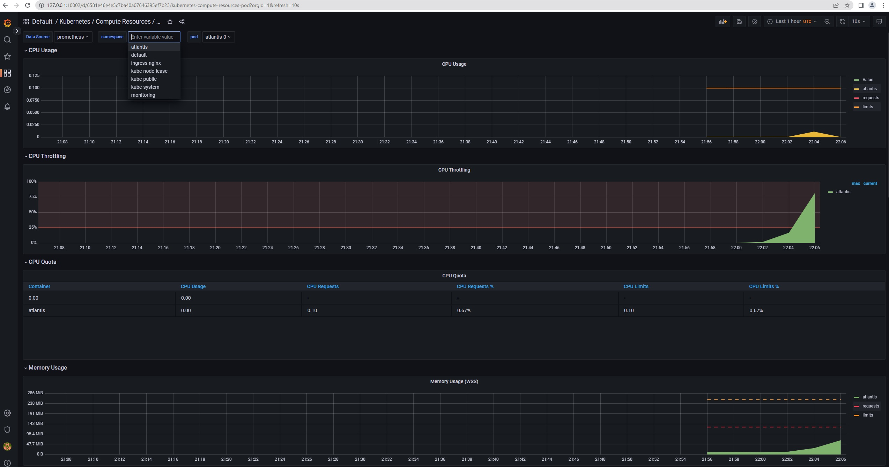
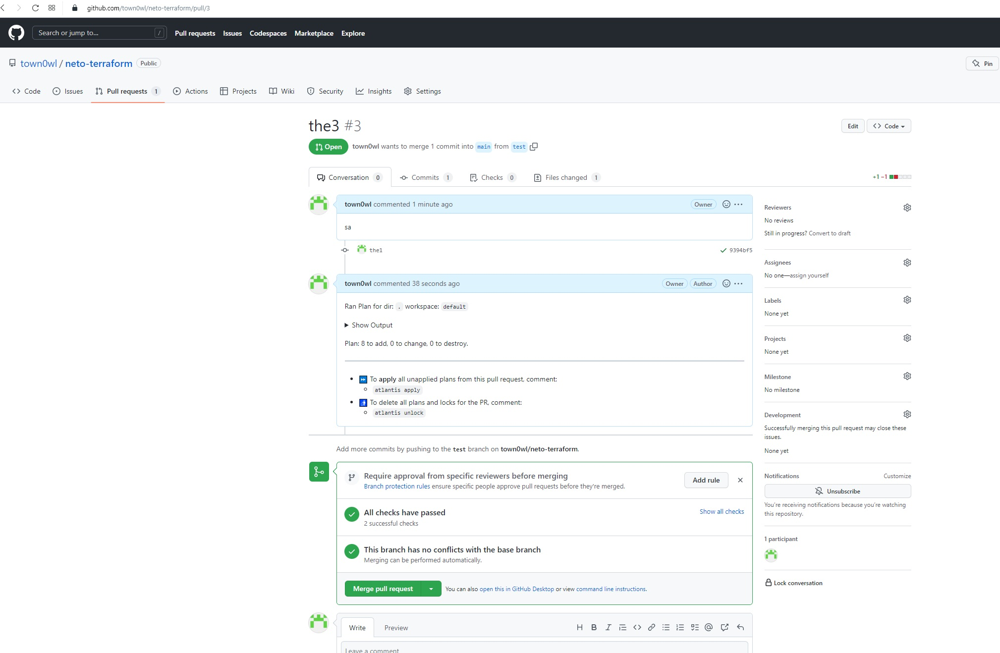
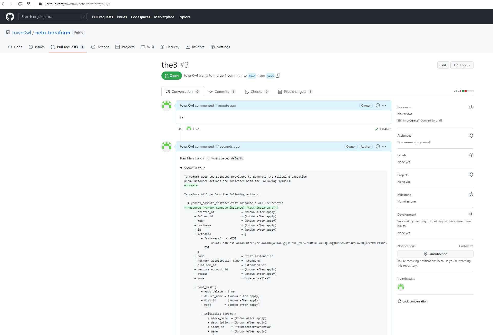
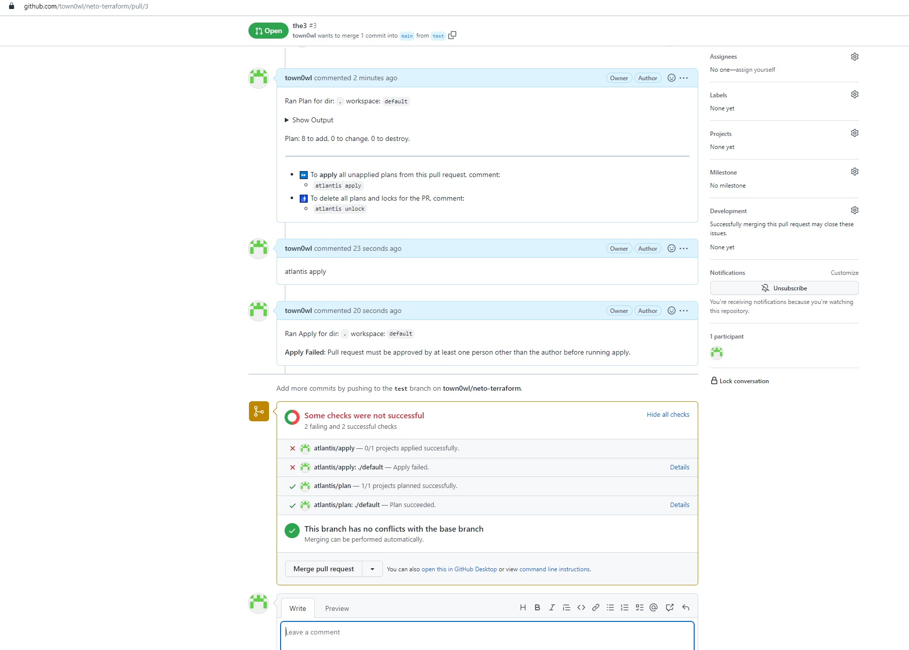
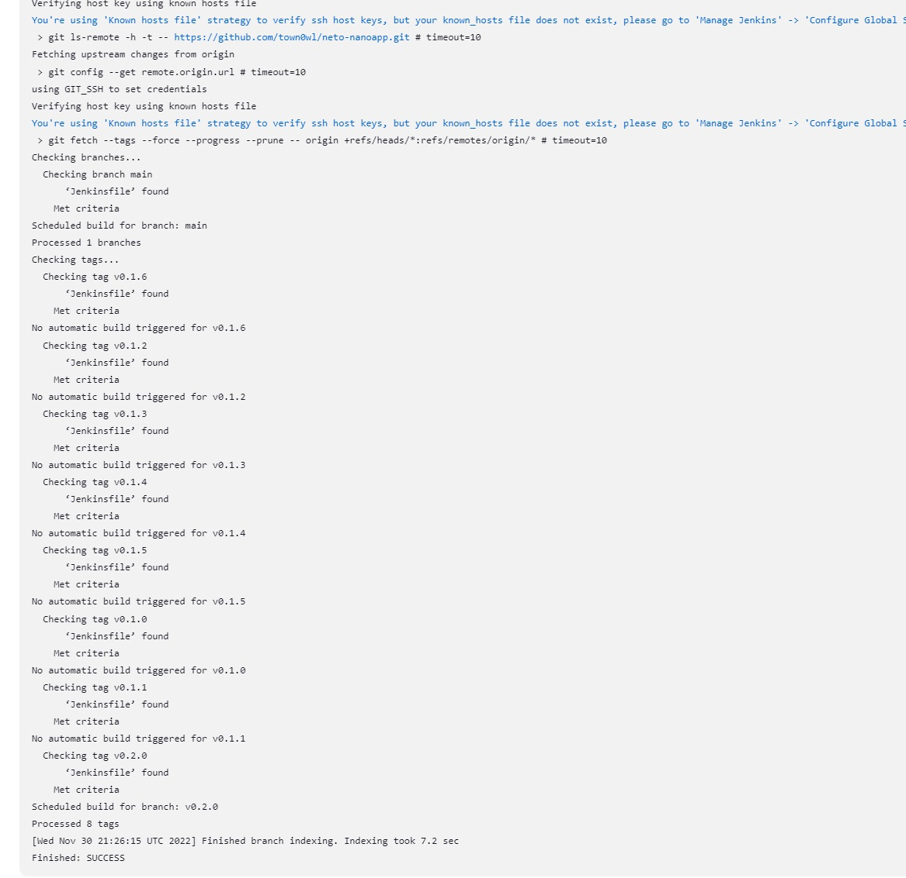
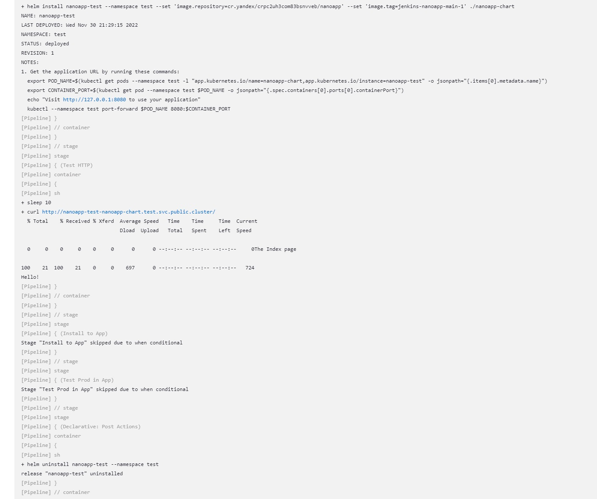
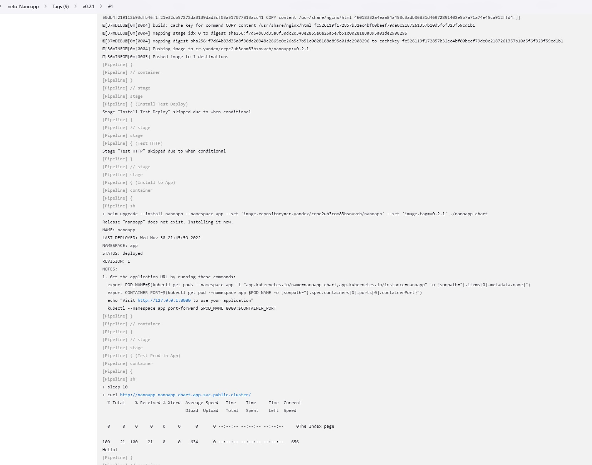
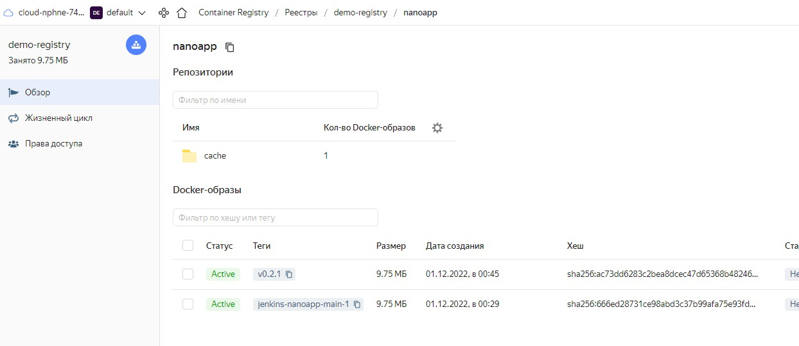

### Terraform

Репозиторий с конфигурацией terraform: https://github.com/town0wl/neto-terraform

Для проекта созданы вручную:
- отдельная папка для проекта в облаке в Yandex Cloud
- бакет для хранения стейтов
- сервисный аккаунт terraform-sa с ролью admin (т.к. terraform будет создавать сервисные аккаунты и назначать роли доступа, иначе - editor) - для работы terraform с ресурсами
- сервисный аккаунт terraform-state с ролями storage.uploader и storage.viewer - для работы terraform со стейтами в бакете

Конфигурация Terraform:
- terraformrc содержит настройки репозитория провайдера Yandex Cloud:
```
provider_installation {
  network_mirror {
    url = "https://terraform-mirror.yandexcloud.net/"
    include = ["registry.terraform.io/*/*"]
  }
  direct {
    exclude = ["registry.terraform.io/*/*"]
  }
}
```
- в файле terraform.tfvars задаются идентификаторы облака и папки yc_cloud_id и yc_folder_id
- ключ аккаунта terraform-sa хранится в файле локально (terraform-sa-key.json), путь к файлу задается в переменной 'base_creds_file' в файле terraform.tfvars
Создание авторизованного ключа для сервисного аккаунта и json-файла с ним (при этом креды админа Yandex Cloud в ~/.config/yandex-cloud/config.yaml):
```
yc iam key create --service-account-name terraform-sa -o terraform-sa-key.json
```
- в файле terraform.tfvars в переменной 'ssh_pubkey_file' задается публичный ключ пары для доступа к хостам проекта
- стейты будут храниться в бакете в облаке, это конфигурируется в секции backend в main.tf. Используетя partial configuration, чтобы задать параметры доступа (bucket, key, access_key, secret_key) в отдельном локальном файле backend.conf. 
Для доступа к бакету требуется статический ключ доступа (включает access_key и secret_key) для сервисного аккаунта Yandex Cloud (при этом креды админа Yandex Cloud в ~/.config/yandex-cloud/config.yaml):
```
yc iam access-key create --service-account-name terraform-state
```
Путь к файлу дополнительной конфигурации задается параметром при инициализации проекта terraform: 
```
terraform init -backend-config="backend.conf"
```
- версии провайдеров фиксируются в файле .terraform.lock.hcl:
```
terraform providers lock -net-mirror=https://terraform-mirror.yandexcloud.net -platform=linux_amd64 -platform=darwin_arm64 -platform=darwin_arm64 -platform=windows_amd64 yandex-cloud/yandex
```
- локально созданы два workspace: stage и prod. 
```
terraform workspace new stage
terraform workspace new prod
```
Стейты воркспейсов terraform хранит в бакете по дополненным путям вида "{bucket}/env:/[stage|prod]/{key}".
  

Создание ресурсов:
1) Файл networks.tf создает сеть с тремя подсетями в разных зонах доступности
2) Файл registry.tf создает Registry для образов
3) Файл hosts.tf создает хосты с заданными приватными адресами
4) Файл serviceaccounts.tf создает сервисные аккаунты и назначает им роли доступа


### Kubespray

Репозиторий с конфигурацией Kubespray (inventory): https://github.com/town0wl/neto-cluster-config

Установка Kubernetes будет проводиться с сервисного хоста изнутри сети. Устанавливаем docker для запуска готового контейнера с Kubespray:
```
apt update
apt install apt-transport-https ca-certificates curl software-properties-common -y
curl -fsSL https://download.docker.com/linux/ubuntu/gpg | sudo gpg --dearmor -o /usr/share/keyrings/docker-archive-keyring.gpg
echo "deb [arch=$(dpkg --print-architecture) signed-by=/usr/share/keyrings/docker-archive-keyring.gpg] https://download.docker.com/linux/ubuntu $(lsb_release -cs) stable" | sudo tee /etc/apt/sources.list.d/docker.list > /dev/null
apt update
apt install docker-ce -y
docker pull quay.io/kubespray/kubespray:v2.20.0
```
Загружаем предзаготовленный inventory:
```
git clone --depth=1 https://github.com/town0wl/neto-cluster-config.git
```
Можно дополнить 'supplementary_addresses_in_ssl_keys' в group_vars/k8s_cluster/k8s-cluster.yml публичным адресом мастера, полученным от terraform.
В ~/.ssh/id_rsa кладем секретный ключ для доступа на хосты кластера.
Запускаем контейнер kubespray с примонтированными inventory и ключом:
```
docker run -it --mount type=bind,source="$(pwd)"/neto-cluster-config,dst=/inventory \
  --mount type=bind,source="${HOME}"/.ssh/id_rsa,dst=/root/.ssh/id_rsa \
  quay.io/kubespray/kubespray:v2.20.0 bash
```
Внутри контейнера запускаем установку Kubernetes:
```
ansible-playbook -i /inventory/inventory.ini --become --become-user=root -v -u ubuntu --private-key /root/.ssh/id_rsa cluster.yml
```
Забираем kubeconfig из /inventory/artifacts/admin.conf в ~/.kube/config на служебный хост и удаляем контейнер с kubespray.

Установка kubectl на служебный хост:
```
curl -LO https://storage.googleapis.com/kubernetes-release/release/`curl -s https://storage.googleapis.com/kubernetes-release/release/stable.txt`/bin/linux/amd64/kubectl
chmod +x ./kubectl
mv ./kubectl /usr/local/bin/kubectl
```


### Мониторинг

Систему мониторинга можно поставить с помощью готовых манифестов из репозитория https://github.com/prometheus-operator.
На служебном хосте:
```
git clone --depth=1 https://github.com/prometheus-operator/kube-prometheus.git
cd kube-prometheus/
kubectl apply --server-side -f manifests/setup
kubectl wait \
 --for condition=Established \
 --all CustomResourceDefinition \
 --namespace=monitoring
kubectl apply -f manifests/
```

Полученные сервисы:
```
NAME                  TYPE        CLUSTER-IP       EXTERNAL-IP   PORT(S)              AGE   SELECTOR
alertmanager-main     ClusterIP   10.201.169.152   <none>        9093/TCP,8080/TCP    28s   app.kubernetes.io/component=alert-router,app.kubernetes.io/instance=main,app.kubernetes.io/name=alertmanager,app.kubernetes.io/part-of=kube-prometheus
blackbox-exporter     ClusterIP   10.201.235.44    <none>        9115/TCP,19115/TCP   27s   app.kubernetes.io/component=exporter,app.kubernetes.io/name=blackbox-exporter,app.kubernetes.io/part-of=kube-prometheus
grafana               ClusterIP   10.201.151.158   <none>        3000/TCP             24s   app.kubernetes.io/component=grafana,app.kubernetes.io/name=grafana,app.kubernetes.io/part-of=kube-prometheus
kube-state-metrics    ClusterIP   None             <none>        8443/TCP,9443/TCP    24s   app.kubernetes.io/component=exporter,app.kubernetes.io/name=kube-state-metrics,app.kubernetes.io/part-of=kube-prometheus
node-exporter         ClusterIP   None             <none>        9100/TCP             23s   app.kubernetes.io/component=exporter,app.kubernetes.io/name=node-exporter,app.kubernetes.io/part-of=kube-prometheus
prometheus-adapter    ClusterIP   10.201.128.217   <none>        443/TCP              21s   app.kubernetes.io/component=metrics-adapter,app.kubernetes.io/name=prometheus-adapter,app.kubernetes.io/part-of=kube-prometheus     
prometheus-k8s        ClusterIP   10.201.21.188    <none>        9090/TCP,8080/TCP    22s   app.kubernetes.io/component=prometheus,app.kubernetes.io/instance=k8s,app.kubernetes.io/name=prometheus,app.kubernetes.io/part-of=kube-prometheus
prometheus-operator   ClusterIP   None             <none>        8443/TCP             21s   app.kubernetes.io/component=controller,app.kubernetes.io/name=prometheus-operator,app.kubernetes.io/part-of=kube-prometheus
```

Получить доступ к Grafana можно с помощью проброса порта:
```
kubectl --namespace monitoring port-forward svc/grafana 10002:3000 &
```

Там доступны преднастроенные доски мониторинга. Примеры:
  
  

### Atlantis

Устанавливается в кластер в виде StatefulSet. Конфигурация Atlantis размещена в репозитории https://github.com/town0wl/neto-atlantis
Для Atlantis требуется создать пользователя GitHub в https://github.com/settings/tokens с правами repo и секретным токеном.
Настроенные в манифесте StatefulSet параметры:
- TF_CLI_CONFIG_FILE
- ATLANTIS_REPO_CONFIG
- ATLANTIS_REPO_ALLOWLIST
- ATLANTIS_GH_USER
- ATLANTIS_GH_TOKEN и ATLANTIS_GH_WEBHOOK_SECRET монтируются из секрета atlantis-vcs
- файлы конфигурации монтируются в /etc/atlantis из секрета atlantis-configs-secret

Секрет с конфигурационными файлами включает:
- backend.conf - параметры доступа terraform к бакету со стейтами (bucket, key, access_key, secret_key)
- terraform-sa-key.json - ключ для доступа сервисного аккаунта terraform к Yandex Cloud
- yc_rsa.pub - публичный ключ, который terraform будет устанавливать на создаваемые хосты для SSH
- atlantis.tfvars - переменные terraform, включающие пути к файлам с ключами и идентификаторы облака и папки (yc_cloud_id, yc_folder_id, base_creds_file="/etc/atlantis/terraform-sa-key.json", ssh_pubkey_file = "/etc/atlantis/yc_rsa.pub") 
- atlantis.yaml - файл с server-side конфигурацией репозиториев для atlantis; подключает /etc/atlantis/backend.conf на стадии init и /etc/atlantis/atlantis.tfvars на стадии plan
- yandex.tfrc - конфигурация репозитория провайдера terraform для Yandex Cloud

```
kubectl create namespace atlantis
kubectl create secret generic atlantis-vcs --from-literal=token=<github_account_token> --from-literal=webhook-secret='<randov_secret_more_then_24>' -n atlantis
kubectl create secret generic atlantis-configs-secret --from-file=backend.conf=backend.conf --from-file=atlantis.tfvars=atlantis.tfvars --from-file=atlantis.yaml=atlantis.yaml --from-file=terraform-sa-key.json=terraform-sa-key.json --from-file=yc_rsa.pub=yc_rsa.pub --from-file=yandex.tfrc=terraformrc -n atlantis
kubectl apply -f atlantis-manifest.yaml -n atlantis
```

Сервис для Atlantis создается с NodePort 30041 для доступа извне для веб-хуков.
Далее в репозитории с конфигурацией terraform настраивается веб-хук: Setting->WebHooks

При создании Pull Request Atlantis получает оповещение, проверяет конфигурацию и собирает plan:
  
  

Отправка команды 'atlantis apply' через комментарии к Pull Request приводит к ошибке 'Pull request must be approved by at least one person other than the author before running apply':
  


### Приложение и Helm

Тестовое приложение и Helm-чарт для его развертывания размещены в https://github.com/town0wl/neto-nanoapp
В качестве тестового приложения используется минималистичный конфиг nginx с несколькими страницами.
Для развертывания приложения используется чарт Helm. Подходит дефолтный чарт, создаваемый при инициализации проекта Helm, с незначительными модификациями deployment.yaml, т.к. для работы nginx не требуется serviceAccount:
```
      {{- if .Values.serviceAccount.disable }}
      automountServiceAccountToken: false
      {{- else }}
      serviceAccountName: {{ include "nanoapp_chart.serviceAccountName" . }}
      {{- end }}
```
В values.yaml и Chart.yaml изменены: образ, имя секрета для аутентификации в registry, ограничения по ресурсам, версия приложения, имя чарта.
Для подключения к репозиторию требуются данные авторизации, монтируемые из секрета k8s-to-cr-pull. Для доступа к репозиторию используется сервисный аккаунт k8s-image-puller, созданный terraform. Т.к. приложение будет развертываться в двух неймспейсах test и app, создаем такой секрет в каждом из них:
```cat k8s-image-puller-key.json | docker login \
  --username json_key \
  --password-stdin \
  cr.yandex
kubectl create namespace app
kubectl create namespace test
kubectl create secret generic k8s-to-cr-pull --namespace app \
    --from-file=.dockerconfigjson=/root/.docker/config.json \
    --type=kubernetes.io/dockerconfigjson
kubectl create secret generic k8s-to-cr-pull --namespace test \
    --from-file=.dockerconfigjson=/root/.docker/config.json \
    --type=kubernetes.io/dockerconfigjson
```


### Jenkins

Для реализации CI/CD используется Jenkins, установленный из Helm-чарта.
Предварительно требуется создать PersistentVolume для данных Jenkins и сервисный аккаунт для доступа Jenkins к кластеру. Используется статический hostPath на ноде, при монтировании будут сохранены права доступа, установленные на ноде, поэтому их можно настроить заранее или после привязки PV к конкретной ноде после установки.
```
kubectl create namespace jenkins

jenkins-volume.yaml:
apiVersion: v1
kind: PersistentVolume
metadata:
  name: jenkins-pv
  namespace: jenkins
spec:
  storageClassName: jenkins-pv
  accessModes:
  - ReadWriteOnce
  capacity:
    storage: 5Gi
  persistentVolumeReclaimPolicy: Retain
  hostPath:
    path: /data/jenkins-volume/

kubectl apply -f jenkins-volume.yaml

mkdir /data
mkdir /data/jenkins-volume
chown -R 1000:1000 /data/jenkins-volume

wget https://raw.githubusercontent.com/jenkins-infra/jenkins.io/master/content/doc/tutorials/kubernetes/installing-jenkins-on-kubernetes/jenkins-sa.yaml
kubectl apply -f jenkins-sa.yaml

wget -O jenkins-values.yaml https://raw.githubusercontent.com/jenkinsci/helm-charts/main/charts/jenkins/values.yaml
```

В jenkins-values.yaml меняем лимиты Jenkins и агентов на подходящие и задаем следующие параметры:
```
clusterZone: "public.cluster"
persistence:
storageClass: jenkins-pv
  accessMode: "ReadWriteOnce"
  size: "5Gi"
serviceAccount:
  create: false
  # The name of the service account is autogenerated by default
  name: jenkins
  annotations: {}
  imagePullSecretName:
```

В список плагинов для установки 'installPlugins' добавляем basic-branch-build-strategies:71.vc1421f89888e.
Затем устанавливаем Jenkins:
```
helm repo add jenkinsci https://charts.jenkins.io
helm repo update
helm install jenkins -n jenkins -f jenkins-values.yaml jenkinsci/jenkins
```
Получить пароль:
```
kubectl exec --namespace jenkins -it svc/jenkins -c jenkins -- /bin/cat /run/secrets/additional/chart-admin-password && echo
```
Прокинуть порт для доступа:
```
kubectl --namespace jenkins port-forward svc/jenkins 8080:8080 &
```

### CI/CD

CI/CD контроллируется Jenkinsfile, размещенным в репозитории с тестовым приложением https://github.com/town0wl/neto-nanoapp
Сборка образа осуществляется Kaniko. Для доступа к репозиторию ему требуется секрет jenkins-to-cr-push с учетными данными сервисного аккаунта, имеющего права пуша в репозиторий. Используется аккаунт jenkins-image-pusher с ролями container-registry.viewer, container-registry.images.scanner, container-registry.images.pusher, container-registry.images.puller, созданный terraform. Создаем секрет:
```
kubectl create secret docker-registry jenkins-to-cr-push --docker-server=cr.yandex --docker-username=json_key --docker-password="$(cat jenkins-image-pusher-key.json)" --docker-email=jenkins-image-pusher@adm.local -n jenkins
```
Для монтирования идентификатора локального репозитория создаем ConfigMap:
```
kubectl create configmap registry-id --from-literal=registry-id=crpc2uh3com83bsnvveb -n jenkins
```
Для доступа Jenkins к GitHub в конфигурации проекта на GitHub Settings->Deploy Keys->Add Deploy Key добавляем ключ для Jenkins. В Jenkins 'Настроить Jenkins'->'Manage Credentials' добавляем этот ключ в виде 'SSH Username with private key' с произвольным username.
Создаем Multibranch Pipeline в Jenkins с репозиторием https://github.com/town0wl/neto-nanoapp.git в качестве источника, созданным в Jenkins ключом для доступа. Добавляем 'Discover tags' к 'Discover branches'. Добавляем 'Buils Strategy' Tags, это позволит Jenkins парсить теги в перемнную TAG_NAME при сборке. Добавляем стратегию 'None Strategies Match', включающую все, кроме явно исключенных, в ней исключаем Tags, это будет собирать остальные ветки. Настраиваем период для автоматической проверки изменений 'Scan Multibranch Pipeline Triggers'.

В Jenkinsfile осуществляются сборка и отправка в репозиторий образа; затем для веток без тега - деплой приложения в неймспейс test, проверка доступности веб-страницы; для веток с тегом - обновление или первичная установка приложения в неймспейс app; в конце удаление приложения из неймспейса test при его наличии.

Пример сканирования репозитория со стороны Jenkins:  
  
Пример части вывода сборки ветки main:  
  
Пример части вывода сборки тега и установки приложения:
  
Образы в локальном репозитории:  
  